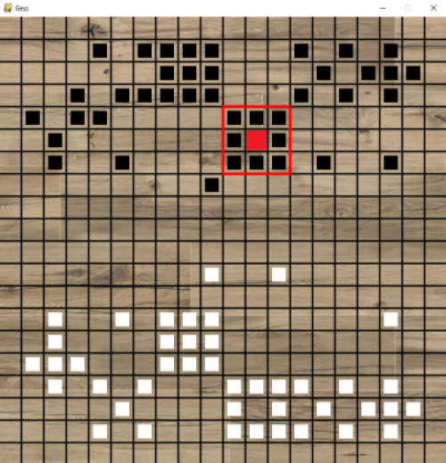

# Gess

### Motivation

My final project for CS162 was an implementation of the board game [Gess](https://www.chessvariants.com/crossover.dir/gess.html) in Python, playable from the command line. After completion, I decided to make the game playable via a GUI interface using [PyGame](https://www.pygame.org/).

### What You'll Need

* Full GUI version: 
The game requires Python3.6+ and PyGame to run the GUI version. 

* Command line version:
Without PyGame, the game can still be played from the command line with any version of Python3.

**To install PyGame:**

```
python3 -m pip install pygame
```

If you don't have admin rights, or would like to only install PyGame for your current user profile, try adding the `user` flag, like so:

```
python3 -m pip install pygame --user
```

If you are still having trouble installing PyGame, please visit the PyGame Wiki's [Getting Started](https://www.pygame.org/wiki/GettingStarted) page.

### In Action



### How To Play

The game rules are available [here](https://www.chessvariants.com/crossover.dir/gess.html#:~:text=There%20are%20two%20players%2C%20black,belonging%20to%20the%20opposing%20player.).

**PyGame**

```
python game\_pygame.py
```

**Command Line**

```
python game\GessGame.py
```

### Work Left To Do

This game is a work in progress. A list of intended features I intend to add can be found on [the project's Kanban board](https://github.com/users/mitchcampbell/projects/3).

Given that this game began as a project with a few strict requirements for how it should be interacted with, and the PyGame GUI was grafted on after completion, there are some peculiarities in the architecture and design. For example, most of the (for lack of a better term) "back end" game logic resides in a single file, GessGame.py, and the files starting with an underscore "_" contain the means by which the PyGame GUI "plays" GessGame.py. That said, the game doesn't really require much in the way of performance, so I may or may not recreate the project depending on if it seems like a worthwhile learning experience.
